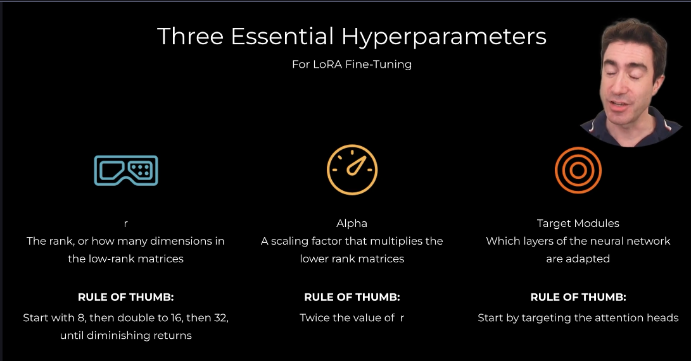

# RAG

<figure><figcaption></figcaption></figure>

Types of LLM

1. auto regressive llm (chat)
2. auto encoding llm (embeddings)

<figure><figcaption></figcaption></figure>

### Evaluation

<figure><figcaption></figcaption></figure>

Text Splitters

1. RecursiveCharacterTextSplitter
2. MarkdownTextSplitter
3. MarkdownHeaderTextSplitter

Semantic Chunking

### Advanced RAG technique

<figure><figcaption></figcaption></figure>

### Finetuning LLM

file.create(file, purpose=batch,fine-tune)

<figure><figcaption></figcaption></figure>

#### Dataset

Deployment:

<figure><figcaption></figcaption></figure>

## Lora: Low rank Adapter

1. Supervised finetuning
2. Direct preference optimization
3. Reinforcement finetuning

<figure><figcaption></figcaption></figure>
